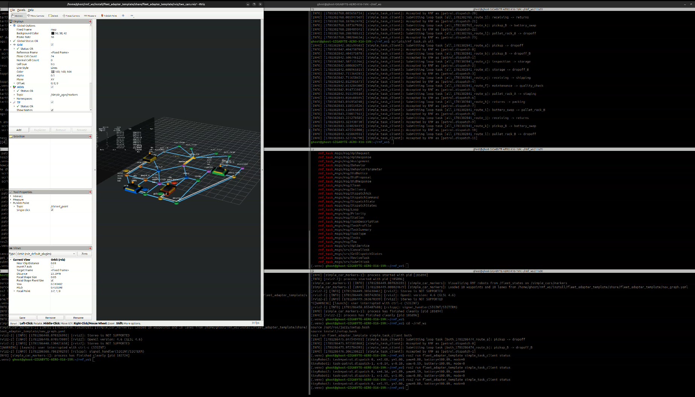
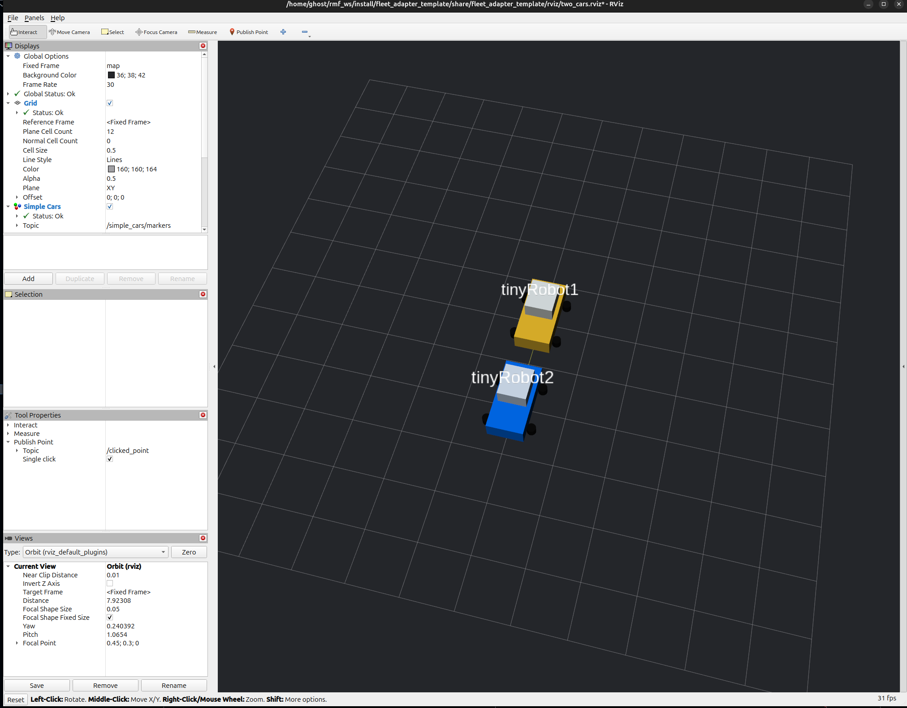
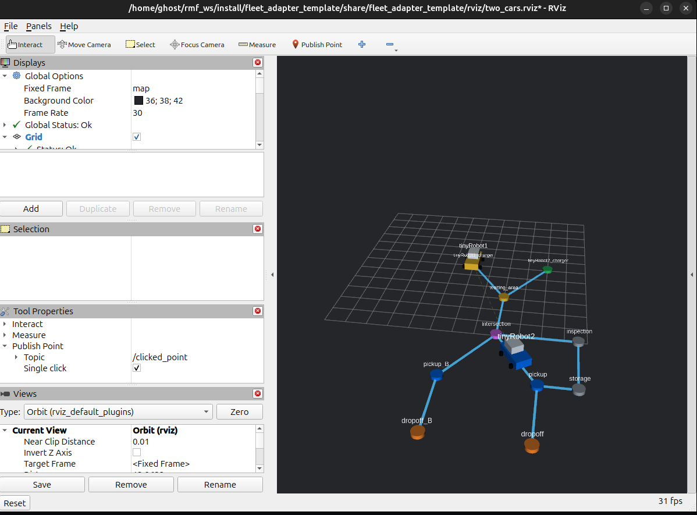
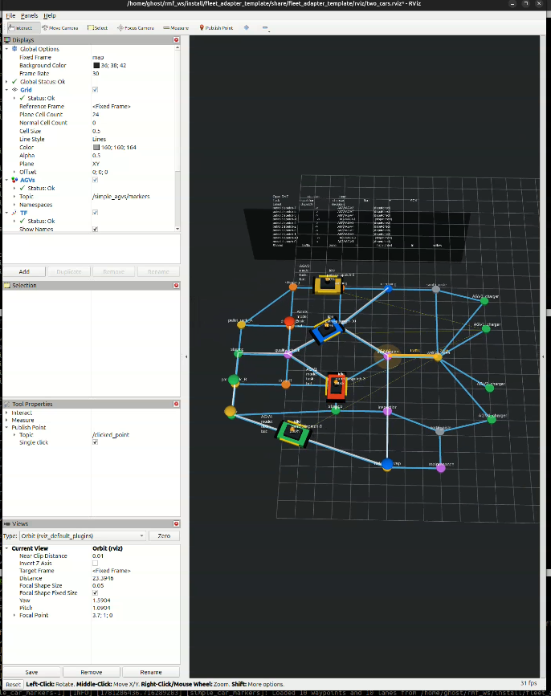
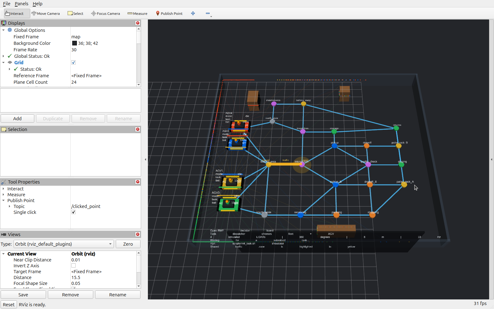

# ROS 2 Open-RMF Demo

This repository is my learning workspace for building a small Open-RMF demo
with ROS 2 Jazzy. The goal was to start from the official Open-RMF fleet
adapter template, understand the parts that make RMF move robots, and turn it
into a visible RViz demo with fake AGVs, a navigation graph, task submission,
status inspection, pause/resume controls, and a larger warehouse-style route
network. It now includes simulated 360-degree LiDAR on all four AGVs, with
independent scan topics and colored scan returns in RViz.

The project is intentionally small. It does not use real robots, SLAM, a real
warehouse map, or a production fleet manager. Instead, it focuses on the core
RMF learning path:

- define a fleet of robots
- describe where those robots can move
- connect a fleet adapter to RMF
- submit tasks to the RMF task dispatcher
- visualize robot state, routes, waypoints, and RMF decisions in RViz



## How I Got Here

I started from the Open-RMF `fleet_adapter_template` because it shows the
standard shape of a Python `full_control` fleet adapter. That template explains
where the robot API belongs, how the adapter registers a fleet with RMF, and
how RMF receives robot position updates and sends navigation commands.

From there, I built the demo step by step:

1. I created a ROS 2 workspace at `~/rmf_ws`.
2. I added the Open-RMF fleet adapter template under `src/`.
3. I installed and used ROS 2 Jazzy and the Open-RMF packages already available
   on the system.
4. I edited the fleet configuration so RMF knew about multiple AGVs, their
   chargers, motion limits, battery settings, and task capabilities.
5. I created a simple `nav_graph.yaml` with named waypoints and lanes. RMF uses
   this graph as the robot traffic map.
6. I implemented a fake in-memory robot API so the demo could move simulated
   AGVs without connecting to real hardware.
7. I added an RViz marker visualizer so the fake robots are easier to
   understand than plain coordinates in a terminal.
8. I added task helper scripts so I could quickly submit loop tasks, inspect
   dispatches, pause/resume robots, cancel tasks, and print fleet state.
9. I expanded the first two-robot experiment into a larger multi-route demo
   with four AGVs, more warehouse waypoints, and multiple task routes.
10. I pushed the final workspace into this GitHub repository so the full demo
    can be rebuilt and explained from source.

The result is a teaching/demo workspace: RMF handles scheduling and task
dispatch, while this repository provides the fake robot side and RViz
visualization needed to see what is happening.

## Documentation I Used

These were the main documentation sources and references behind the workspace:

- [Open-RMF fleet adapter template](https://github.com/open-rmf/fleet_adapter_template)
- [Open-RMF project repositories](https://github.com/open-rmf)
- [ROS 2 Jazzy documentation](https://docs.ros.org/en/jazzy/)
- [RMF task message interfaces](https://docs.ros.org/en/jazzy/p/rmf_task_msgs/)
- [RViz documentation](https://docs.ros.org/en/jazzy/Tutorials/Intermediate/RViz/RViz-User-Guide/RViz-User-Guide.html)

The most important idea from the documentation is that Open-RMF does not drive a
robot directly like a low-level motor controller. RMF coordinates fleets at a
traffic and task level. A fleet adapter sits between RMF and the robots. The
adapter tells RMF where each robot is, what the fleet can do, and when a robot
has reached a destination. RMF then assigns tasks and sends navigation requests
back through the adapter.

## What This Demo Does

This workspace runs a fake AGV fleet through Open-RMF. The demo starts the RMF
traffic schedule, the RMF task dispatcher, the fleet adapter, and RViz. Then
tasks can be sent from another terminal.

The RViz scene shows:

- AGV bodies with labels
- charger locations
- named warehouse waypoints
- lane connections from `nav_graph.yaml`
- active route markers
- task destinations
- a decision/status board
- robot names, modes, task IDs, and battery percentages

The first milestone was simply proving that fake robot state could be published
and drawn in RViz.



After that, I connected the robots to an RMF navigation graph so tasks could use
named locations such as `pickup`, `dropoff`, `pickup_B`, and `dropoff_B`.



The final version expands the map into a larger warehouse-style graph with more
routes and four AGVs.



## Repository Layout

```text
.
├── README.md
├── images/
├── scripts/
│   ├── start_rmf_demo.sh
│   ├── stop_rmf_demo.sh
│   ├── rmf_menu.sh
│   └── rmf_task.sh
└── src/
    └── fleet_adapter_template/
        ├── README.md
        └── fleet_adapter_template/
            ├── config.yaml
            ├── nav_graph.yaml
            ├── fleet_adapter_template/
            │   ├── RobotClientAPI.py
            │   ├── fleet_adapter.py
            │   ├── simple_car_markers.py
            │   └── simple_task_client.py
            ├── launch/
            ├── maps/
            ├── rviz/
            └── worlds/
```

Key files:

- `config.yaml` defines the RMF fleet, robot names, chargers, limits, battery
  model, and task capabilities.
- `nav_graph.yaml` defines the named waypoints and directed lanes that RMF uses
  for route planning.
- `RobotClientAPI.py` provides the fake robot API. In a real system this would
  talk to the robot or fleet manager.
- `fleet_adapter.py` connects the fake robot API to RMF.
- `simple_car_markers.py` draws the RViz scene.
- `simple_task_client.py` submits tasks and reads status from RMF.
- `scripts/start_rmf_demo.sh` starts the schedule, dispatcher, adapter, and
  RViz together.
- `scripts/rmf_task.sh` wraps the task client so commands are short and
  repeatable.

More detailed package-level notes are in:

```text
src/fleet_adapter_template/README.md
```

## Main Concepts

### Fleet Adapter

The fleet adapter is the bridge between Open-RMF and the robots. RMF does not
know how to command my fake AGVs directly. Instead, the adapter registers the
fleet, publishes robot state, receives RMF navigation requests, and translates
those requests into robot API calls.

In this workspace, the robot API is fake and runs in memory. That made it
possible to learn the RMF flow before connecting physical robots or a real fleet
manager.

### Navigation Graph

The file `nav_graph.yaml` is the traffic map. It contains vertices with names
like `AGV1_charger`, `waiting_area`, `intersection`, `pickup`, `dropoff`,
`receiving`, `shipping`, and `battery_swap`.

The lanes are directed. If a hallway should work both ways, the graph includes
both directions:

```yaml
- [0, 2, {}]
- [2, 0, {}]
```

RMF uses this graph to reason about valid paths, task starts, task finishes, and
traffic conflicts.

### Task Dispatcher

The task dispatcher receives task requests such as "loop from pickup to
dropoff". It chooses which robot should do the task and gives the work to the
fleet adapter. The task helper script can submit a single route, many routes,
or a conflict demo where two robots need the shared traffic area.

### RViz Visualization

RViz is used as the learning view. Instead of watching only logs, I added custom
markers so the map, robots, labels, and active tasks are visible. This made it
much easier to confirm that RMF was assigning tasks and that the fake robots
were moving through the graph.

## Setup

This workspace expects ROS 2 Jazzy and Open-RMF packages to be installed on the
machine.

Clone the repository:

```bash
git clone git@github.com:Ahmed-Bouhachem/Ros2_OpenRMF_Demo.git ~/rmf_ws
cd ~/rmf_ws
```

Source ROS 2 and build the package:

```bash
source /opt/ros/jazzy/setup.bash
colcon build --packages-select fleet_adapter_template
source install/setup.bash
```

If a local Python virtual environment exists, the helper scripts will activate
it automatically.

## Running The Demo

### Four-car LiDAR recording

Each AGV now has a simulated 360-degree planar LiDAR: 360 samples, 8 m maximum
range, and 10 scans/second. RViz opens with four color-matched LaserScan displays,
light scan beams, and warehouse walls/racks. Scans detect the nearest obstacle
or another car, and update as the cars move. The camera includes the full scene.



Rebuild after pulling these changes, then start a fresh demo:

```bash
cd ~/rmf_ws
source /opt/ros/jazzy/setup.bash
colcon build --packages-select fleet_adapter_template
scripts/stop_rmf_demo.sh
scripts/start_rmf_demo.sh
```

In a second terminal, start your screen recording while the four cars are at
their chargers, then submit the showcase:

```bash
cd ~/rmf_ws
scripts/rmf_task.sh showcase
```

Capture the colored scan returns on the walls and racks as cars move, then
zoom in on cars detecting each other near the shared traffic zone. The RViz
Displays panel lets you toggle each `AGV1 LiDAR` through `AGV4 LiDAR` display;
disable the `AGV*_lidar_rays` namespaces under `LiDAR scene and beams` if you
prefer only scan points. Use `scripts/rmf_task.sh pause_all` and `resume_all`
to hold/release the cars for close-ups (RMF task time continues while paused).
For a repeat take, stop and restart the demo so tasks and poses start fresh.

Scan topics are `/AGV1/scan`, `/AGV2/scan`, `/AGV3/scan`, and `/AGV4/scan`, using
`sensor_msgs/msg/LaserScan` with sensor-data QoS (best effort). Each scan uses
its car's `AGVn/lidar` TF frame, 0.44 m above the base. Scans and car transforms
share a timestamp. Scans stop if fleet updates are absent for two seconds.
The same sensors run with `scripts/start_rmf_demo.sh --headless`.

`lidar_scene.yaml` defines the boxes used both for scan intersection and RViz
obstacles. This is a deterministic 2D ray-casting demo, with other cars modeled
as rectangular footprints; it does not model sensor noise, rolling scans, or
Gazebo physics. LiDAR is visualization/sensor output here, not an input to
obstacle avoidance, SLAM, or RMF navigation. Keep scene obstacles clear of the
navigation lanes when editing them.

Start the full demo:

```bash
cd ~/rmf_ws
scripts/start_rmf_demo.sh
```

This script starts:

- `rmf_traffic_schedule`
- `rmf_task_dispatcher`
- `fleet_adapter_template fleet_adapter`
- `two_cars_rviz.launch.py`

In another terminal, send the showcase task set:

```bash
cd ~/rmf_ws
scripts/rmf_task.sh showcase
```

Launching the demo leaves the cars at their chargers until tasks are submitted.
The start script includes six seconds of startup waits for the ROS components.
After `showcase`, movement begins as RMF assigns tasks; the dispatcher uses a
two-second bidding window, so all four cars do not necessarily start together.
The showcase command continues printing status while the robots are moving.

Print the current robot state:

```bash
scripts/rmf_task.sh status
```

List known dispatch IDs:

```bash
scripts/rmf_task.sh dispatches
```

Stop the running demo with `Ctrl-C` in the terminal that started
`scripts/start_rmf_demo.sh`, or run:

```bash
scripts/stop_rmf_demo.sh
```

## Task Commands

The helper script supports these commands:

```bash
scripts/rmf_task.sh route_a
scripts/rmf_task.sh route_b
scripts/rmf_task.sh route_c
scripts/rmf_task.sh route_d
scripts/rmf_task.sh route_e
scripts/rmf_task.sh route_f
scripts/rmf_task.sh route_g
scripts/rmf_task.sh route_h
scripts/rmf_task.sh route_i
scripts/rmf_task.sh route_j
scripts/rmf_task.sh route_k
scripts/rmf_task.sh route_l
scripts/rmf_task.sh both
scripts/rmf_task.sh all
scripts/rmf_task.sh showcase
scripts/rmf_task.sh conflict
scripts/rmf_task.sh status
scripts/rmf_task.sh dispatches
scripts/rmf_task.sh pause_all
scripts/rmf_task.sh resume_all
scripts/rmf_task.sh reset_all
```

Example route meanings:

- `route_a`: `pickup -> dropoff`
- `route_b`: `pickup_B -> dropoff_B`
- `route_e`: `receiving -> shipping`
- `route_i`: `battery_swap -> pallet_rack_B`
- `route_l`: `pallet_rack_B -> dropoff`

You can also submit a custom loop between any two waypoint names:

```bash
scripts/rmf_task.sh loop pickup dropoff
```

## What I Achieved

By the end of this workspace, I had:

- a ROS 2 Jazzy workspace that builds with `colcon`
- a working Open-RMF fleet adapter demo
- fake AGV movement without real robot hardware
- four configured AGVs with charger waypoints
- a custom navigation graph with warehouse-style named locations
- task submission through the RMF dispatcher
- task status and dispatch inspection commands
- pause, resume, and reset controls for the fake robot API
- RViz markers for robots, lanes, waypoints, routes, and task status
- a repeatable start script for running the demo with fewer terminals
- screenshots that document the project from early two-robot visualization to
  the larger four-AGV route demo

## Validation

The LiDAR update was checked with six geometry tests covering nearest-hit
occlusion, no returns and maximum range, the near-sensor blind zone, rotated
car footprints, sensor position/orientation, and moving targets. Run them with:

```bash
cd ~/rmf_ws
source /opt/ros/jazzy/setup.bash
source install/setup.bash
python3 -m pytest -q src/fleet_adapter_template/fleet_adapter_template/test/test_lidar_geometry.py
```

The update was also checked in the running ROS 2/RViz demo:

- All four scan topics published at 10 Hz, with 360 samples per scan.
- Scan transforms resolved to `map` at their acquisition timestamps and the
  configured 0.44 m sensor height.
- Scan returns changed while every car moved during the showcase.
- RMF accepted all twelve showcase tasks.
- RViz rendered the warehouse obstacles, scan points, and scan beams.
- The new geometry, sensor, and geometry-test modules passed Flake8 checks.

These checks verify the simulated sensor output and demo integration; they
do not validate a physical LiDAR or a collision-avoidance controller.

The workspace was built with:

```bash
source /opt/ros/jazzy/setup.bash
colcon build --packages-select fleet_adapter_template
```

The build completed successfully. The current package may show setuptools
deprecation warnings for dashed option names in `setup.cfg`; those warnings do
not stop the demo from building.

## Next Steps

Useful next improvements would be:

- replace the fake robot API with a real robot or fleet manager API
- add a real Traffic Editor building map
- connect a physical robot pose source
- improve task cancellation behavior for active tasks
- add launch files for one-command backend-only and visualization-only runs
- record a short demo video using the `showcase` route set
